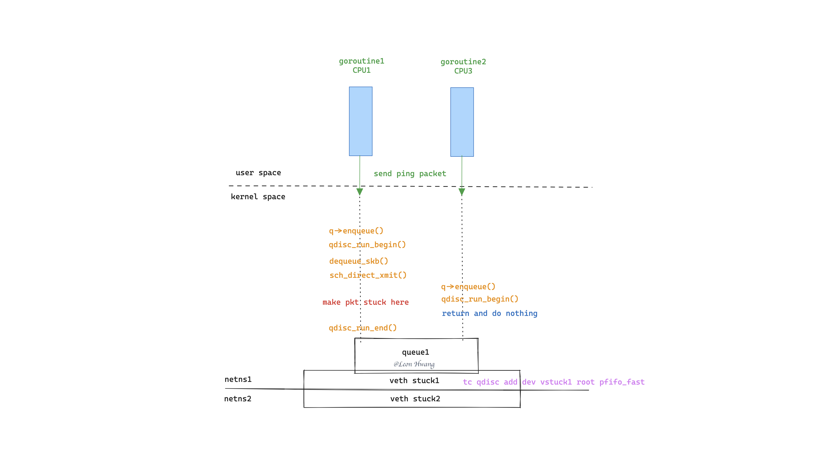

# Make packets stuck in lockless pfifo_fast qdisc

When I read the discussion about [net: sched: fix packet stuck problem for lockless qdisc](https://lore.kernel.org/lkml/1620868260-32984-2-git-send-email-linyunsheng@huawei.com/) on Twitter, an idea lingered in my mind: why not use eBPF to reproduce the issue?

## Read the f\*\*king source code

Above all, I had to read the kernel source code to figure out how does the pfifo_fast qdisc work.

```c
__dev_queue_xmit()    // ${KERNEL}/net/core/dev.c
|-->__dev_xmit_skb() {
        if (q->flags & TCQ_F_NOLOCK) {
            rc = q->enqueue(skb, q, &to_free) & NET_XMIT_MASK;
            qdisc_run(q);
            if (unlikely(to_free))
                kfree_skb_list(to_free);
            return rc;
        }
    }
    |-->qdisc_run()   // ${KERNEL}/include/net/pkt_sched.h
        |-->qdisc_run_begin() {
        |       if (qdisc->flags & TCQ_F_NOLOCK) {
        |           if (!spin_trylock(&qdisc->seqlock))
        |               return false;
        |           WRITE_ONCE(qdisc->empty, false);
        |       }
        |   }
        |-->__qdisc_run()   // ${KERNEL}/net/sched/sch_generic.c
        |   |-->qdisc_restart()
        |       |-->sch_direct_xmit()
        |           |-->dev_hard_start_xmit()   // ${KERNEL}/net/core/dev.c
        |               |-->xmit_one() {
        |                       trace_net_dev_start_xmit(skb, dev);
        |                       rc = netdev_start_xmit(skb, dev, txq, more);
        |                       trace_net_dev_xmit(skb, rc, dev, len);
        |                   }
        |-->qdisc_run_end() {
                if (qdisc->flags & TCQ_F_NOLOCK)
                    spin_unlock(&qdisc->seqlock);
            }
```

With this code snippet, the issue may be a little easy to reproduce by making a packet stuck in `sch_direct_xmit()`.

## Design the experiment



The key is to make packets stuck in `sch_direct_xmit()`.

With recognizing some tracepoints/kprobes in `sch_direct_xmit()` procedure, it’s easy to cost some CPU with eBPF in the tracepoints/kprobes.

Then, intervally, two `goroutine`s do send ICMP ECHO packets to do ping.

So, as expected, one packet should be stuck in `sch_direct_xmit()`, and the other one should be enqueued and the packet handing should finish at `qdisc_run_begin()` then return early.

> The experiment environment:
>
> It’s a Virtualbox VM with Debian 11 (bullseye) system.

```shell
# cat /etc/os-release
PRETTY_NAME="Debian GNU/Linux 11 (bullseye)"
NAME="Debian GNU/Linux"
VERSION_ID="11"
VERSION="11 (bullseye)"
VERSION_CODENAME=bullseye
ID=debian
HOME_URL="https://www.debian.org/"
SUPPORT_URL="https://www.debian.org/support"
BUG_REPORT_URL="https://bugs.debian.org/"

# uname -a
Linux hwang 5.10.0-8-amd64 #1 SMP Debian 5.10.46-4 (2021-08-03) x86_64 GNU/Linux

# llc --version
Homebrew LLVM version 15.0.7
  Optimized build.
  Default target: x86_64-apple-darwin22.5.0
  Host CPU: skylake

  Registered Targets:
    aarch64    - AArch64 (little endian)
    aarch64_32 - AArch64 (little endian ILP32)
    aarch64_be - AArch64 (big endian)
    amdgcn     - AMD GCN GPUs
    arm        - ARM
    arm64      - ARM64 (little endian)
    arm64_32   - ARM64 (little endian ILP32)
    armeb      - ARM (big endian)
    avr        - Atmel AVR Microcontroller
    bpf        - BPF (host endian)
    bpfeb      - BPF (big endian)
    bpfel      - BPF (little endian)
    hexagon    - Hexagon
    lanai      - Lanai
    mips       - MIPS (32-bit big endian)
    mips64     - MIPS (64-bit big endian)
    mips64el   - MIPS (64-bit little endian)
    mipsel     - MIPS (32-bit little endian)
    msp430     - MSP430 [experimental]
    nvptx      - NVIDIA PTX 32-bit
    nvptx64    - NVIDIA PTX 64-bit
    ppc32      - PowerPC 32
    ppc32le    - PowerPC 32 LE
    ppc64      - PowerPC 64
    ppc64le    - PowerPC 64 LE
    r600       - AMD GPUs HD2XXX-HD6XXX
    riscv32    - 32-bit RISC-V
    riscv64    - 64-bit RISC-V
    sparc      - Sparc
    sparcel    - Sparc LE
    sparcv9    - Sparc V9
    systemz    - SystemZ
    thumb      - Thumb
    thumbeb    - Thumb (big endian)
    ve         - VE
    wasm32     - WebAssembly 32-bit
    wasm64     - WebAssembly 64-bit
    x86        - 32-bit X86: Pentium-Pro and above
    x86-64     - 64-bit X86: EM64T and AMD64
    xcore      - XCore
```

## Unexpected experiment case

But, the world does not work expectedly.

```shell
# ./pkt-stucker -r 192.168.1.2
2023/07/26 22:29:42.119848 Attached tracepoint(net:net_dev_start_xmit))
2023/07/26 22:29:42.120646 Attached tracepoint(net:net_dev_xmit))
2023/07/26 22:29:42.122134 Listening events...
2023/07/26 22:29:42.122615 Ticking every 10ms to send packets
2023/07/26 22:29:42.122921 Recving packets
2023/07/26 22:29:42.123057 Sending packets on CPU 1 in stuck1 netns
2023/07/26 22:29:42.129358 Sending packets on CPU 3 in stuck1 netns
2023/07/26 22:29:42.133930 Sent packet on CPU 1 with seq 100, cost 538.504µs
256 bytes from 192.168.1.2: icmp_seq=100 time=974.026µs
2023/07/26 22:29:42.147394 Sent packet on CPU 1 with seq 102, cost 503.232µs
256 bytes from 192.168.1.2: icmp_seq=102 time=75.845895ms (Bingo)
2023/07/26 22:29:42.195977 Sent packet on CPU 3 with seq 101, cost 672.386µs
2023/07/26 22:29:42.226659 Error: found a packet cost 75.845895ms

# cat /sys/kernel/debug/tracing/trace_pipe
     pkt-stucker-332947  [001] d... 18578.382391: bpf_trace_printk: net_dev_start_xmit on CPU 1, seq: 100, ts: 18582188406462
     pkt-stucker-332947  [001] d... 18578.382629: bpf_trace_printk: net_dev_xmit on CPU 1, seq: 100, ts: 18582188650031
     pkt-stucker-332947  [001] d... 18578.395846: bpf_trace_printk: net_dev_start_xmit on CPU 1, seq: 102, ts: 18582201870819
     pkt-stucker-332947  [001] d... 18578.396040: bpf_trace_printk: net_dev_xmit on CPU 1, seq: 102, ts: 18582202066973
     pkt-stucker-332943  [003] d... 18578.444378: bpf_trace_printk: net_dev_start_xmit on CPU 3, seq: 101, ts: 18582250428892
     pkt-stucker-332943  [003] d... 18578.444644: bpf_trace_printk: net_dev_xmit on CPU 3, seq: 101, ts: 18582250695454
```

## Run the demo

When the VM prepares, run the demo:

```shell
# apt install -y git clang-15 llvm-15
# git clone https://github.com/Asphaltt/pkt-stucker.git
# cd pkt-stucker
# go generate
# go build
# bash setup-env.sh
# echo "bash clear-env.sh finally"
# ./pkt-stucker -r 192.168.1.2
#
# echo In another terminal
# cat /sys/kernel/debug/tracing/trace_pipe
```

## In conclusion

Wow, congrad, the issue is reproduced.
